<!--
**k-l-lambda/k-l-lambda** is a ✨ _special_ ✨ repository because its `README.md` (this file) appears on your GitHub profile.

Here are some ideas to get you started:

- 🔭 I’m currently working on ...
- 🌱 I’m currently learning ...
- 👯 I’m looking to collaborate on ...
- 🤔 I’m looking for help with ...
- 💬 Ask me about ...
- 📫 How to reach me: ...
- 😄 Pronouns: ...
- ⚡ Fun fact: ...
-->

### [My Blog](https://k-l-lambda.github.io/)

* [基于VAE的音乐编码器](https://k-l-lambda.github.io/2023/11/29/vae-based-music-encoder/)
* [Contemporary Art Genres and Artists Style Exhibition](https://k-l-lambda.github.io/2023/05/28/ai-art-styles/)
* [How to represent a Rubik's cube state in a calculable form?](https://k-l-lambda.github.io/2020/12/14/rubik-cube-notation/)
* [StyleGAN Mapping Network Geometry Visualization](https://k-l-lambda.github.io/2020/02/10/stylegan-mapping/)

### [My OMR web app(mobile): Find曲谱识别](https://parser.findpiano.cn/)

### [My Youtube Channel](https://www.youtube.com/@k.l.6905)

* [Rubik's cube is matrix!](https://www.youtube.com/watch?v=vfSx63VBGxc)
* [The best OMR app up to 2022](https://www.youtube.com/watch?v=06-q7S4Giuo&t=14s)

### [K.L. Studio](https://k-l-lambda.github.io/klstudio/)

* [MIDI Web Player](https://k-l-lambda.github.io/klstudio/#/midi-player)
* [Chess Lab (chess analyser with engine of stockfish)](https://k-l-lambda.github.io/klstudio/#/chess-lab)
* [Cube & Matrix](https://k-l-lambda.github.io/klstudio/#/documents/dynamic-labeled-cube3)
* [Spiral Piano](https://k-l-lambda.github.io/klstudio/#/spiral-piano)

